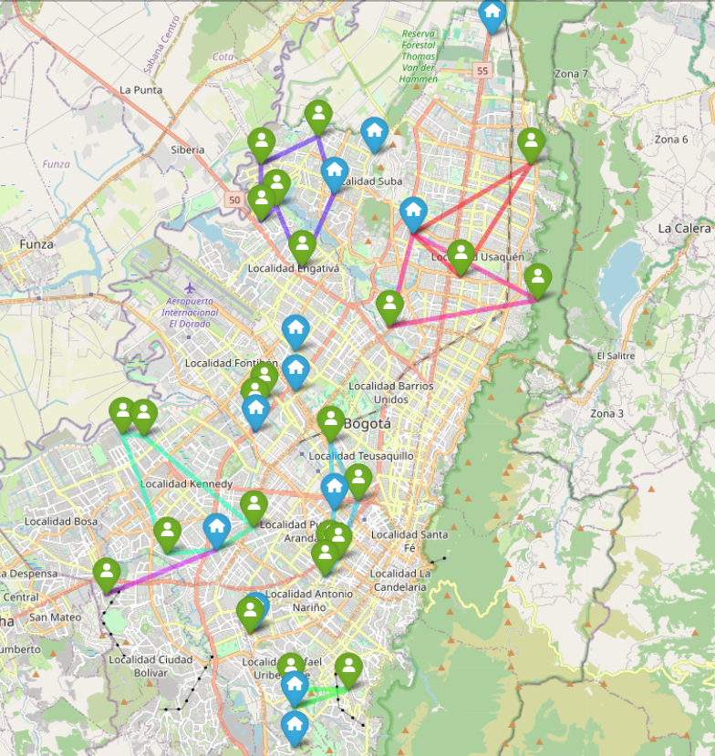

# Route Optimization with Complex Constraints 🚛📊

Welcome to the **Route Optimization with Complex Constraints** repository! This project presents an innovative and efficient approach to solving route assignment and optimization problems using ground vehicles, electric vehicles, and drones. The solution was designed and developed as part of the "Seneca Libre" project and is based on quantitative analysis, visualizations, and a practical approach to reducing operational costs.

> **Authors:**  
> - Carlos Casadiego - [cdcp2](https://github.com/cdcp2)  
> - Sebastián Ospino - [Sebasos01](https://github.com/Sebasos01)  

---

## 🧩 **Project Description**

This project addresses route optimization problems in diverse scenarios, incorporating realistic constraints such as:

- **Mixed capacities** of vehicles and distribution centers.
- **Minimization of operational costs** (loading, distance, recharging, maintenance, etc.).
- **Supply management** under capacity constraints.
- **Handling multiple products** with heterogeneous demands.

The results are illustrated with optimized routes and detailed cost breakdowns, supported by graphical visualizations.

**Analyzed Scenarios:**

1. **Base Scenario:** Initial optimization with standard constraints.
2. **Cost Evaluation:** Reduction of total costs with high customer density.
3. **Supply Management:** Inclusion of capacity constraints in distribution centers.
4. **Handling Multiple Products:** Added complexity with mixed demands and heterogeneous products.

---

## 📊 **Visualizations and Results**

Each scenario includes:

- **Parameter Description:** Customers, vehicles, demand, and specific constraints.
- **Generated Routes:** Detailed optimization for each vehicle.
- **Cost Breakdown:** Impact of each component on the total cost.
- **Graphical Visualization:** Generated route maps to facilitate understanding.

### Example of Visualization 📌
**Route generated for Case 1:**

---

## 🚀 **Key Features**

- **Adaptability:** The model adjusts routes based on complex constraints and personalized objectives.
- **Efficiency:** Reduction of operational costs while maintaining compliance with constraints.
- **Scalability:** Flexible design to incorporate new constraints or future scenarios.
- **Visualization:** Clear images and tables for quick interpretation of results.

---

## 📂 **Repository Structure**

- **Docs/**:
  - Contains the model and the results report.
  
- **reports/**:
  - Contains all reports and generated routes for the 4 case studies.
  
- **solution.ipynb**:
  - Main notebook with all the model code, from data loading to problem solving.
  
- **Geneticos.ipynb**:
  - Contains the genetic algorithms bonus code to approach the problem from an evolutionary perspective.

---

## 🏆 **Conclusions**

- The proposed solution demonstrates **efficiency and adaptability** in route assignment under complex constraints.
- The detailed cost breakdown allows for identifying key optimization areas.
- The integration of multiple constraints, such as distribution center capacity and mixed products, showcases the **model's flexibility** to solve real-world problems.

---

## 📖 **General Documentation**

1. **Utility Functions for the Cost Matrix:**
   - `haversine(coord1, coord2)`: Calculates the distance in kilometers between two points given by coordinates (latitude, longitude) using the Haversine formula.
   - `compute_distance_matrix(data)`: Prepares the coordinates, calls the OSRM API to obtain ground distances, and calculates aerial distances (drones) using the Haversine function.

2. **Function to Solve the Vehicle Routing Model:**
   - `solve_vehicle_routing_problem(data)`: Builds and solves the vehicle routing optimization model using Pyomo. Includes:
     - Definition of sets and parameters (nodes, vehicles, vehicle types, etc.).
     - Decision variables (assignment of customers to vehicles, used arcs, assignment of depots, etc.).
     - Model constraints (flow, capacity, depot assignment, subcycle elimination, etc.).
     - Objective function to minimize costs (loading/unloading, distance, time, recharging, and maintenance).
     - Solver call (Gurobi or other) and returns the solution in dictionary form.

3. **Function to Visualize Routes:**
   - `print_vehicle_routes(solution, data)`: Prints the routes of each vehicle to the console based on the obtained solution.

4. **Utility Functions to Load Data:**
   - Various functions (`read_clients`, `read_vehicles`, `read_depots`, etc.) that load and validate data from CSV files for clients, vehicles, depots, capacities, loading/unloading costs, and vehicle types.

5. **Report Generation:**
   - `generate_reports(solution, data)`: From the solution, generates CSV and TXT files with the routes, the objective function value, and an operational cost report.

6. **Visualization with Maps:**
   - Additional code to generate an interactive map with Folium showing nodes and resulting routes.

---

## 🛠️ **Code Workflow**

1. Data is loaded from CSV files (either selecting a base case or entering routes manually).
2. Distances between nodes are calculated.
3. The vehicle routing optimization model is built and solved.
4. A JSON file with the solution is generated.
5. Routes are printed, and additional reports are generated (CSV with routes, TXT with the objective value, TXT with the cost report).
6. The solution is visualized on an interactive map using Folium.

---

Feel free to explore the repository, run the notebooks, and examine the detailed reports and visualizations. If you find this project useful or interesting, don't hesitate to include it in your portfolio or share it with other professionals! ⭐

---

